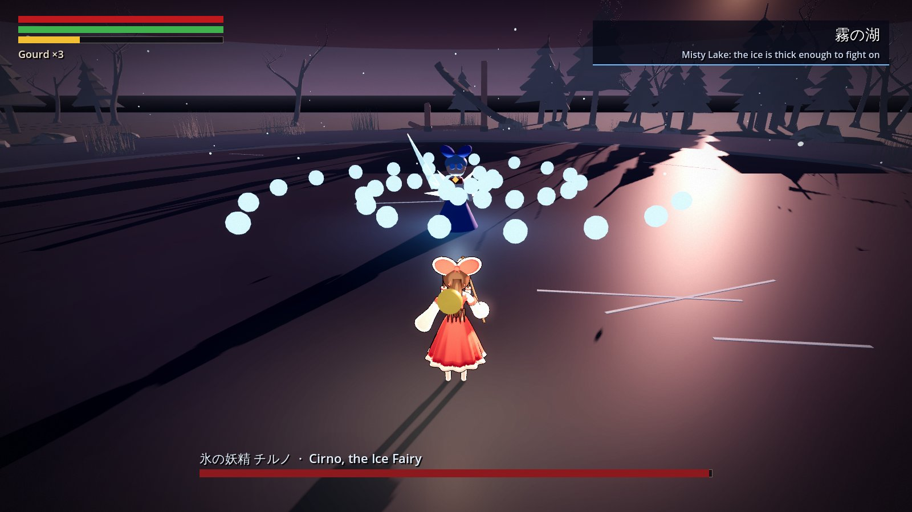
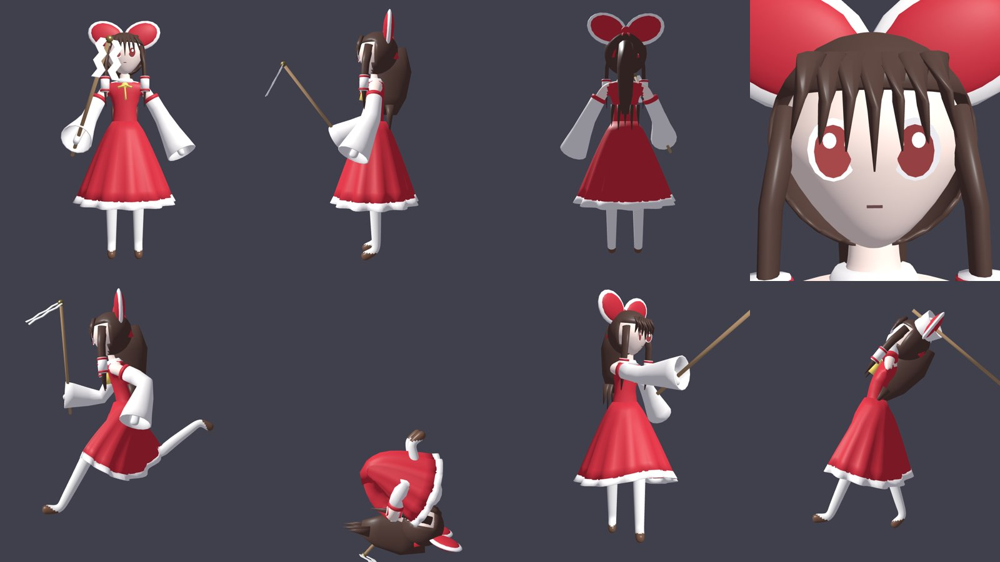
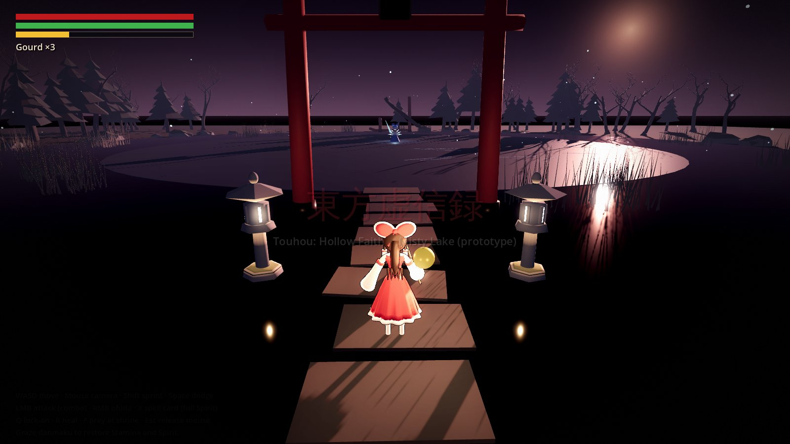
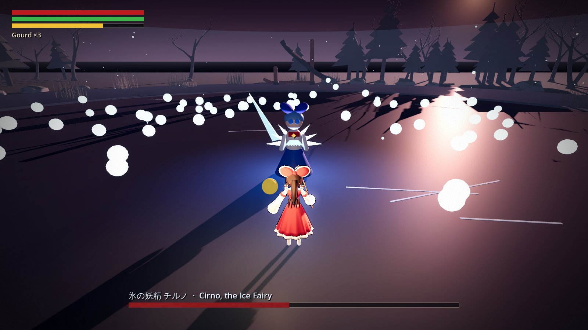
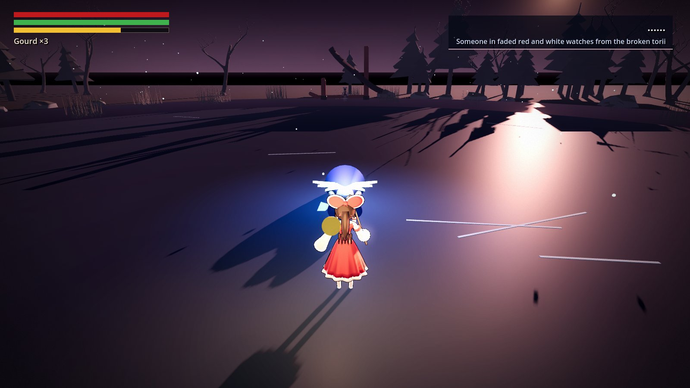

# 東方虚信録 ~ Touhou: Hollow Faith

A **Touhou Project fan-made Soulslike** (東方Project二次創作), built in Godot 4.

> Touhou Project and all of its characters are the property of ZUN / Team Shanghai Alice
> (上海アリス幻樂団). This is an unofficial fan work.
> It is intended for release on Steam, subject to permission from the rights holder.



## Status

Prototype vertical slice: **Misty Lake at dusk**. Walk from a wayside shrine through a
torii to the frozen lake and fight **Cirno**, a two-phase boss mixing Souls melee with
danmaku and two spell cards. Reimu and the Misty Lake environment are in-house Blender
assets (first pass, generated by the scripts in `tools/blender/`). Cirno is still a
primitive placeholder. Sound effects and placeholder music are synthesised at runtime.

The design is in [docs/GAME_DESIGN.md](docs/GAME_DESIGN.md), and the story and original
characters are in [docs/STORY_AND_CHARACTERS.md](docs/STORY_AND_CHARACTERS.md).



| | |
|---|---|
|  |  |
|  | |

## Running

1. Install [Godot 4.3+](https://godotengine.org/download) (standard build, not .NET).
2. Open `project.godot` in the editor and press **F5**, or run `godot --path .`.

## Controls

| Action | Keyboard / mouse | Gamepad |
|---|---|---|
| Move / camera | WASD / mouse | left stick / right stick |
| Sprint | Shift | A (hold) |
| Dodge roll | Space | B |
| Attack (combo) | LMB or J | RB |
| Ofuda (10 Spirit) | RMB or K | RT |
| Spell card: Fantasy Seal (100 Spirit) | X | LB |
| Lock-on | Q, Tab or MMB | R3 |
| Heal | R | X |
| Pray at shrine | F or E | Y |
| Release mouse | Esc | |

Grazing bullets (letting them pass close) restores stamina and fills Spirit.

## Core gameplay code (private)

The core gameplay logic (scenes, gameplay scripts and tests) is not kept in this repository.
It lives in a private `core/` folder at the project root, which `.gitignore` excludes.
Drop the private `core/` folder into a clone of this repo to run the game:

```sh
godot --headless --path . --import
godot --headless --path . -s core/tests/smoke_test.gd
```

## Layout

```
core/                     private gameplay code (not in Git): scenes, scripts, tests
data/                     game content data: areas, enemies, items, dialogue, lore
tools/blender/            Blender scripts that build the in-house models and animations
assets/                   final models, audio and textures go here
```
