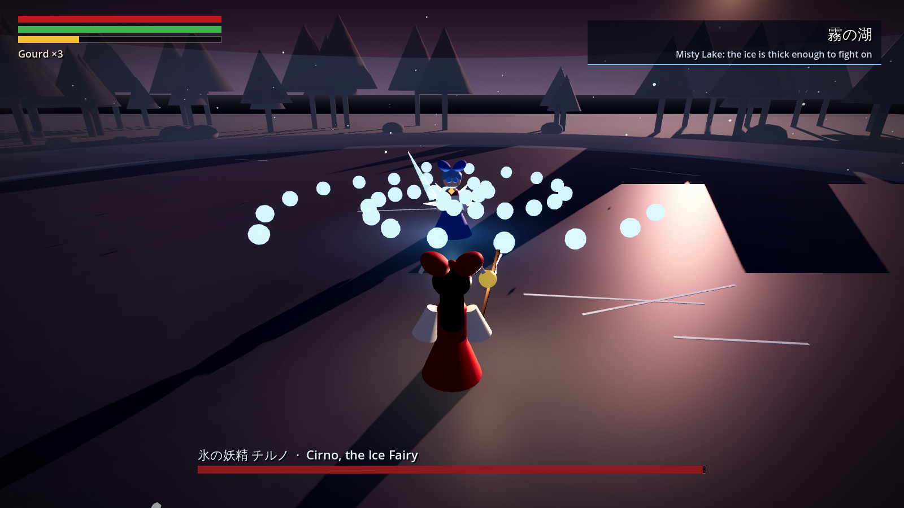
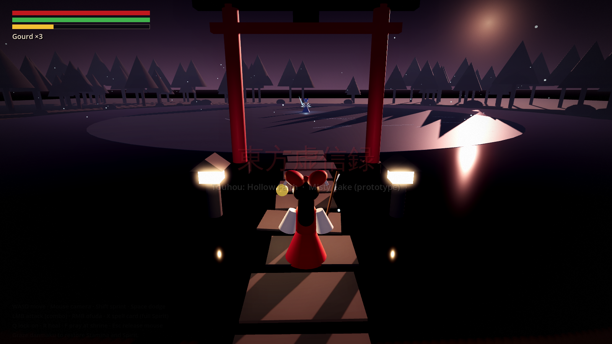
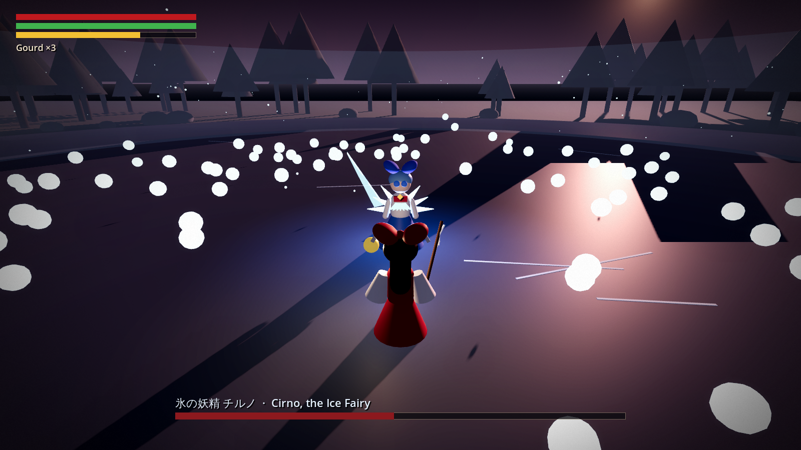

# 東方虚信録 ~ Touhou: Hollow Faith

A **Touhou Project fan-made Soulslike** (東方Project二次創作), built in Godot 4.

> Touhou Project and all of its characters are the property of ZUN / Team Shanghai Alice
> (上海アリス幻樂団). This is an unofficial fan work.
> It is intended for release on Steam, subject to permission from the rights holder.



## Status

Prototype vertical slice: **Misty Lake at dusk**. Walk from a wayside shrine through a
torii to the frozen lake and fight **Cirno**, a two-phase boss mixing Souls melee with
danmaku and two spell cards. All models are greybox placeholders built from primitives;
sound effects and placeholder music are synthesised at runtime.

The design is in [docs/GAME_DESIGN.md](docs/GAME_DESIGN.md).

| | |
|---|---|
|  |  |

## Running

1. Install [Godot 4.3+](https://godotengine.org/download) (standard build, not .NET).
2. Open `project.godot` in the editor and press **F5**, or run `godot --path .`.

## Controls

| Action | Keyboard / mouse | Gamepad |
|---|---|---|
| Move / camera | WASD / mouse | left stick / right stick |
| Sprint | Shift | A (hold) |
| Dodge roll | Space | B |
| Attack (combo) | LMB or J | RB |
| Ofuda (10 Spirit) | RMB or K | RT |
| Spell card: Fantasy Seal (100 Spirit) | X | LB |
| Lock-on | Q, Tab or MMB | R3 |
| Heal | R | X |
| Pray at shrine | F or E | Y |
| Release mouse | Esc | |

Grazing bullets (letting them pass close) restores stamina and fills Spirit.

## Tests

```sh
godot --headless --path . -s tests/smoke_test.gd
```

Walks into the arena, forces every boss action in both phases, casts a spell card, dies
and respawns, prays, and defeats the boss. Prints `SMOKE TEST PASSED` on success.

## Layout

```
scenes/main.tscn          entry scene (everything else is built in code)
scripts/main.gd           level layout, environment, fight flow, respawn
scripts/player.gd         Reimu: movement, stamina, combo, dodge, ofuda, spell card
scripts/boss_cirno.gd     Cirno AI, attack patterns, spell cards
scripts/bullet_manager.gd danmaku update, hit and graze detection
scripts/camera_rig.gd     orbit camera, lock-on, shake
scripts/hud.gd            bars, boss bar, spell card banner, messages
scripts/shrine.gd         checkpoint
scripts/sfx.gd            runtime-synthesised placeholder SFX
scripts/music.gd          runtime-synthesised placeholder music (explore / boss loops)
assets/                   final models, audio and textures go here
```
