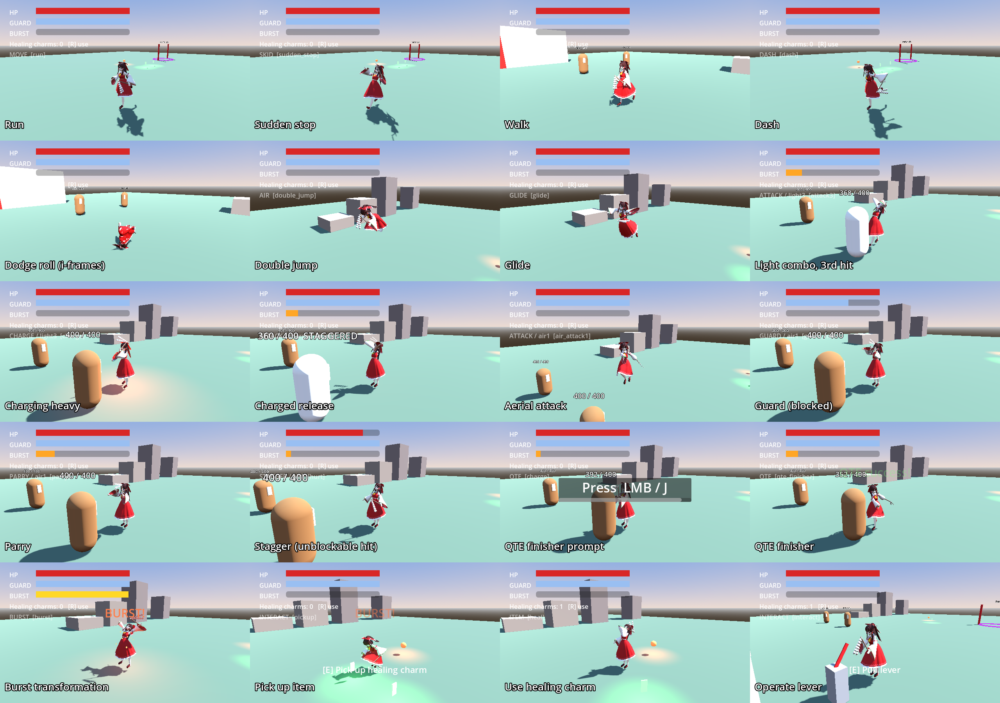

# Reimu action set

The playable controller is `player/player.gd`, a single explicit state machine. The model is `characters/reimu/reimu.glb`. Run `demo/arena.tscn` (the main scene) to try every action against two training dummies.



## Controls

| Action | Keyboard / mouse | Gamepad |
|---|---|---|
| Move | WASD | Left stick (light tilt = slow walk, half tilt = walk) |
| Walk toggle / slow walk | Alt / hold Ctrl | L3 / light tilt |
| Jump (double jump, glide) | Space | A |
| Dodge roll (air: air dash) | Shift | B |
| Dash | Q | RB |
| Light attack | LMB or J | X |
| Heavy attack (hold to charge) | RMB or K | Y |
| Guard / parry | F or L | LB |
| Burst | V | R3 |
| Interact / use item | E / R | D-pad up / down |
| Help overlay | F1 | Back |

`systems/game_input.gd` registers these bindings at startup. Any action you define in Project Settings overrides its default.

## Actions → states → animations

The model ships 13 clips: idle, run, roll, attack1–3, dash_attack, charge, cast, spell, heal, hurt and death. `tools/build_extra_animations.gd` bakes 23 more from the same rig into `reimu_extra_anims.res` (marked ★ below).

| Category | Action | State | Clip | Notes |
|---|---|---|---|---|
| Movement | Slow walk | MOVE | slow_walk★ | 1.1 m/s, hold Ctrl or a light stick tilt |
| | Walk | MOVE | walk★ | 2.2 m/s, Alt toggle or a half tilt |
| | Run | MOVE | run | 5.6 m/s |
| | Sudden stop | SKID | sudden_stop★ | Releasing at a run, or reversing, plants the feet. The skid lasts about 0.45 s, cancellable after 0.12 s, and reversing turns her on the spot |
| | Dash | DASH | dash★ | 13 m/s for 0.22 s; works once in the air |
| | Dodge | DODGE | roll | Invulnerable from 0.03 to 0.34 s; dodging through a hit counts as a perfect evade (+burst) |
| Jumping | Jump | AIR | jump_start★ → jump_rise★ → fall★ → land★ | Coyote time, early release cuts height |
| | Double jump | AIR | double_jump★ (front flip) | 1 air jump, 2 during burst |
| | Glide | GLIDE | glide★ | Hold jump after the last air jump; falls at 1.6 m/s max |
| Offense | Light combo | ATTACK | attack1 → attack2 → attack3 | Input buffered within the chain window |
| | Combo branches | ATTACK | heavy_attack★ / cast | Light → heavy; light, light → heavy (ofuda burst) |
| | Heavy | ATTACK | heavy_attack★ | Tap heavy |
| | Charged | CHARGE → ATTACK | charge → spell | Hold heavy; damage and radius scale with charge time |
| | Dash attack | ATTACK | dash_attack | Light during a dash or within 0.25 s after it |
| | Aerial | ATTACK | air_attack1★ → air_attack2★, air_slam★ | Hangs in the air while swinging; heavy in the air is a plunge with a shockwave |
| Defense | Guard | GUARD | guard★, guard_hit★ | Blocks frontal hits and drains the guard gauge; an empty gauge means guard break → stagger |
| | Parry | PARRY | parry★ | Press guard within 0.18 s of a hit. Staggers the attacker, +burst, light during the parry ripostes |
| | Unblockable | — | — | Red telegraph: guard does nothing, dodge it |
| System | Recovery cancel | — | — | From each attack's `cancel` time, dodge, jump or dash interrupts the recovery. Earlier presses are buffered and fire on that frame |
| | Hitstun / stagger | HURT / STAGGER | hurt, stagger★ | Light hit flinches, heavy hit staggers |
| | Tech recovery | RECOVER | tech_recover★ | Dodge or jump during the stun window; invulnerable |
| | QTE finisher | QTE | charge → qte_finisher★ | Break a dummy's posture, then press interact for a 3-prompt QTE in slow motion. Success deals 3 × 40 damage; failure knocks Reimu back |
| | Story QTE | QTE | guard → parry | The barrier rift in the arena; failing it hurts |
| Special | Burst (overload) | BURST | burst★ | Full gauge: invulnerable transformation and a shockwave, then 12 s of ×1.6 damage, ×1.25 speed, ×1.2 animation speed, an extra air jump, super armor against light hits and half guard cost |
| Items | Pick up | INTERACT | pickup★ | Healing charms (kept) and faith orbs (+35 burst) |
| | Use healing item | ITEM | heal | +40 HP at 0.6 s; a hit before then saves the charm |
| | Operate mechanism | INTERACT | interact★ | The lever raises the shrine gate |

The attack frame data (damage, active window, cancel time, chain window, lunge, reach) lives in the `ATTACKS` table at the top of `player/player.gd`.

## Tools

The tests need Godot 4.4. Add `xvfb-run` and `--rendering-driver opengl3` when running headless on a server without a display.

```sh
# Run all 33 action tests (162 checks); exits 1 on failure
godot --headless --fixed-fps 60 --path . res://tests/test_actions.tscn

# Rebuild the generated clips after editing tools/build_extra_animations.gd
godot --headless --path . --script res://tools/build_extra_animations.gd

# Contact sheet of any clips (needs a renderer)
godot --resolution 200x240 --path . --script res://tools/anim_sheet.gd -- out.png walk glide parry

# Re-render the screenshot sheet above (needs a renderer)
godot --fixed-fps 60 --resolution 640x360 --path . res://tools/showcase.tscn -- docs/actions_showcase.png
```
